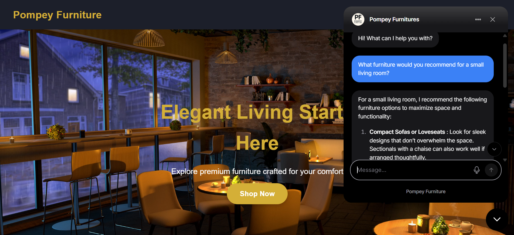
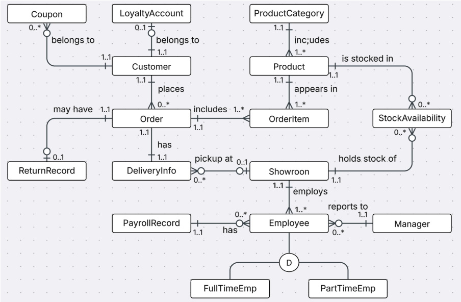

# Furniture Retail Management System

A full-stack, database-driven web application developed as part of a university team project at the University of Portsmouth.

The system supports core operations of a multi-showroom furniture retailer, including product and inventory management, customer accounts, orders, deliveries, returns, loyalty features, employee management and payroll.

> **Academic project:** Developed for educational and demonstration purposes using simulated data.

---

## Project Preview



---

## Key Features

- **Product & inventory management** - Manages furniture products, categories and stock availability across multiple showroom locations.
- **Customer accounts** - Supports customer registration, login and account-related functionality.
- **Order management** - Handles customer orders containing multiple products and associated order details.
- **Delivery & collection** - Supports home delivery and showroom pickup workflows.
- **Returns management** - Records product returns and associates them with customer orders.
- **Loyalty & promotions** - Maintains customer loyalty points and promotional coupons.
- **Employee & payroll management** - Supports employees, managers, showroom assignments, employment types and payroll records.
- **Administrative functionality** - Provides interfaces for managing products and operational data.
- **Customer support chatbot integration** - Integrates a Chatbase-powered chatbot to assist users with product-related enquiries and website navigation.

---

## System Overview

The application combines customer-facing retail functionality with administrative and operational workflows.

Customers can browse products, create accounts and interact with order, delivery, return and loyalty functionality. On the operational side, the system maintains product inventory across showroom locations and supports employee and payroll information.

The backend connects these workflows to a relational PostgreSQL database through Node.js and Express.js.

---

## Database Design

The application uses a relational PostgreSQL database designed around the operational requirements of a multi-showroom furniture retailer.



The database models relationships between:

- products and product categories;
- products and showroom stock availability;
- customers, orders and order items;
- customers, loyalty accounts and coupons;
- orders, deliveries and returns;
- showrooms, employees and managers;
- employees, employment types and payroll records.

Key design decisions include:

- `StockAvailability` connects products with showroom locations and maintains location-specific inventory quantities.
- `OrderItem` enables an order to contain multiple products while storing quantity and unit-price information.
- `DeliveryInfo` supports both home delivery and showroom pickup.
- `ReturnRecord` associates returns with their corresponding orders.
- Full-time and part-time employee structures support different employment and salary models.

---

## Business SQL Queries

SQL queries were developed to support operational reporting and business requirements across the relational database.

Examples include:

- **Monthly revenue by showroom** - Calculates sales revenue for individual showroom locations.
- **Product availability and price filtering** - Retrieves products available at a selected showroom within a specified price range.
- **Top-selling products** - Identifies the highest-performing products based on sales volume.
- **Orders with returns** - Retrieves order and customer information associated with returned purchases.

These queries use relational joins, filtering, aggregation, grouping and ordering across multiple tables to transform transactional data into useful business information.

---

## Tech Stack

| Area | Technologies |
| --- | --- |
| Frontend | HTML5, CSS3, JavaScript |
| Backend | Node.js, Express.js |
| Database | PostgreSQL, SQL |
| Database Integration | node-postgres (`pg`) |
| Integration | Chatbase |
| Development Tools | Git, GitHub, npm |

---

## Project Structure

```text
.
├── client/
│   ├── images/
│   │   └── products/
│   ├── videos/
│   ├── index.html
│   ├── products.html
│   ├── customer.html
│   ├── orders.html
│   ├── loyalty.html
│   ├── returns.html
│   ├── admin.html
│   ├── employees.html
│   ├── payroll.html
│   ├── showrooms.html
│   ├── stocks.html
│   └── style.css
│
├── db/
│   ├── create-tables.sql
│   └── seed-data.sql
│
├── do-not-edit/
│   ├── cleanup-db.js
│   ├── db.js
│   └── setup-db.js
│
├── .env.example
├── .gitignore
├── db-config.example.js
├── package.json
└── server.cjs
```

---

## My Contribution

This application was developed collaboratively as part of a university team project.

My contributions included:

- Designed the relational database structure and contributed to the implementation of the PostgreSQL database.
- Developed SQL queries for products, inventory, orders, returns and business reporting.
- Contributed to customer-facing and administrative functionality across the application.
- Integrated application functionality with the database to support core retail operations.
- Tested and debugged key workflows to improve application reliability.
- Refactored parts of the original application, including form handling, configuration and environment-based credential management.

---

## Getting Started

### Prerequisites

Make sure the following are installed:

- Node.js
- npm
- PostgreSQL

### Installation

1. Clone the repository:

```bash
git clone https://github.com/quhtrang-cloud/furniture-retail-management-system.git
```

2. Navigate to the project directory:

```bash
cd furniture-retail-management-system
```

3. Install dependencies:

```bash
npm install
```

4. Create a `.env` file based on `.env.example` and configure your local database credentials.

5. Set up the PostgreSQL database:

```bash
npm run setup
```

6. Start the application:

```bash
npm start
```

7. Open the application in your browser:

```text
http://localhost:3000
```

---

## Environment Configuration

Sensitive credentials and local configuration are managed through environment variables and are not committed to the repository.

Refer to `.env.example` for the required configuration.

Example:

```env
DB_HOST=localhost
DB_PORT=5432
DB_USER=postgres
DB_PASSWORD=YOUR_PASSWORD
DB_NAME=mydb
```

> Never commit the real `.env` file, database passwords, API keys or other credentials to version control.

---

## Database Setup

The project includes scripts for creating and resetting the local development database.

Create the database, tables and simulated seed data:

```bash
npm run setup
```

To reset the development database:

```bash
npm run cleanup
npm run setup
```

---

## Limitations & Future Development

This application was developed as an academic prototype rather than a production retail platform.

Potential future improvements include:

- Secure password hashing and production-grade authentication.
- Stronger role-based authorisation and route protection.
- More comprehensive server-side validation and error handling.
- Database transactions for multi-step operations.
- Automated unit, integration and end-to-end testing.
- Further responsive design and accessibility improvements.
- Expanded inventory, delivery and order-status management.
- Production logging and monitoring.
- HTTPS/TLS and additional production security controls.

---

## Project Context

This project was developed as part of the **Web Product Development and Management** module at the University of Portsmouth.

The project focused on designing and implementing a database-driven web application for a fictional furniture retailer, combining relational database design, SQL, server-side development and web-based business workflows.

All customer, employee, product and transactional data used by the application is simulated for educational purposes.

---

## Author

**Quynh Trang Nguyen**  
MSc Information Systems  
University of Portsmouth